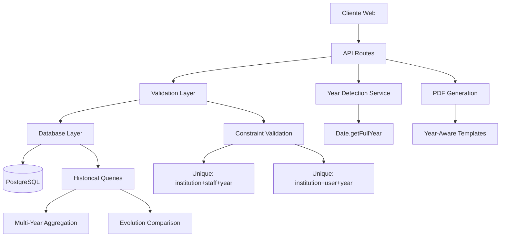
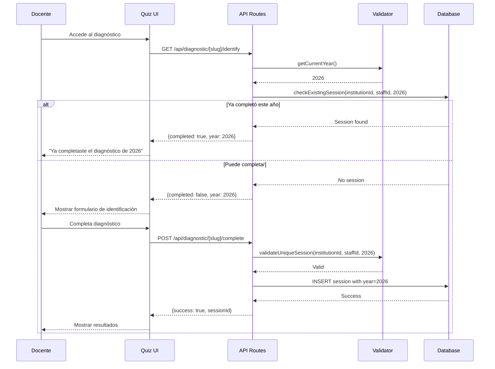

# Documento de Diseño: Sistema de Periodización Anual para Diagnóstico de Habilidades Digitales

## Overview

El sistema de periodización anual permite que los docentes completen el diagnóstico de habilidades digitales una vez por año calendario, manteniendo un histórico acumulativo de su evolución. El sistema detecta automáticamente el año actual, valida que no existan diagnósticos duplicados en el mismo periodo, y proporciona visualizaciones comparativas multi-año tanto para docentes como para administradores institucionales.

Este diseño se enfoca en una arquitectura SaaS escalable que funciona automáticamente sin configuración manual de periodos, soportando miles de instituciones simultáneamente con datos aislados por tenant.

## Arquitectura



## Flujo de Datos Principal



## Componentes y Responsabilidades

### 1. Database Schema Layer

**Propósito**: Almacenar sesiones de diagnóstico con periodización anual y garantizar integridad referencial

**Modificaciones al Schema**:
```typescript
// apps/web/src/lib/db/schema.ts

export const diagnosticSessions = pgTable(
  'diagnostic_sessions',
  {
    id: uuid('id').defaultRandom().primaryKey(),
    institutionId: uuid('institution_id').notNull().references(() => institutions.id),
    userId: uuid('user_id').references(() => users.id),
    staffId: uuid('staff_id').references(() => staff.id),
    year: integer('year').notNull(), // NUEVO CAMPO
    // ... campos existentes
    createdAt: timestamp('created_at').defaultNow().notNull(),
    updatedAt: timestamp('updated_at').defaultNow().notNull(),
  },
  (table) => ({
    // Índices para performance
    yearIdx: index('idx_diagnostic_session_year').on(table.year),
    institutionYearIdx: index('idx_diagnostic_session_institution_year')
      .on(table.institutionId, table.year),
    
    // Constraints de unicidad: un diagnóstico por docente por año
    uniqueInstitutionStaffYear: unique('unique_institution_staff_year')
      .on(table.institutionId, table.staffId, table.year),
    uniqueInstitutionUserYear: unique('unique_institution_user_year')
      .on(table.institutionId, table.userId, table.year),
  })
);
```

**Responsabilidades**:
- Garantizar un diagnóstico por docente por año mediante constraints únicos
- Indexar por año para queries eficientes de histórico
- Mantener integridad referencial con institutions, users, staff


### 2. Year Detection Service

**Propósito**: Proporcionar el año actual de forma consistente en toda la aplicación

**Interface**:
```typescript
// apps/web/src/features/diagnostic/services/year-service.ts

interface YearService {
  getCurrentYear(): number
  isValidYear(year: number): boolean
  getAvailableYears(sessions: DiagnosticSession[]): number[]
}
```

**Responsabilidades**:
- Detectar año actual usando `new Date().getFullYear()`
- Validar que un año sea razonable (ej: >= 2025, <= año actual + 1)
- Extraer lista de años únicos del histórico de sesiones

### 3. Validation Layer

**Propósito**: Validar reglas de negocio antes de operaciones de base de datos

**Interface**:
```typescript
// apps/web/src/features/diagnostic/services/validation-service.ts

interface ValidationService {
  checkExistingSession(
    institutionId: string,
    staffId: string | null,
    userId: string | null,
    year: number
  ): Promise<DiagnosticSession | null>
  
  validateUniqueSession(
    institutionId: string,
    staffId: string | null,
    userId: string | null,
    year: number
  ): Promise<ValidationResult>
}

type ValidationResult = 
  | { valid: true }
  | { valid: false; reason: string; existingYear: number }
```

**Responsabilidades**:
- Verificar si ya existe una sesión para el docente en el año especificado
- Retornar mensajes de error descriptivos
- Manejar casos de staffId vs userId (docentes registrados vs no registrados)


### 4. API Endpoints

#### 4.1 Endpoint: Identificación con Validación de Año

**Ruta**: `POST /api/diagnostic/[slug]/identify`

**Propósito**: Validar identidad del docente y verificar si ya completó el diagnóstico del año actual

**Request Body**:
```typescript
{
  documentType: string
  documentNumber: string
  email?: string
}
```

**Response**:
```typescript
{
  success: boolean
  data?: {
    canComplete: boolean
    year: number
    existingSession?: {
      id: string
      completedAt: string
      year: number
    }
    staff?: {
      id: string
      firstName: string
      lastName: string
    }
  }
  error?: string
}
```

**Responsabilidades**:
- Obtener año actual
- Buscar docente por documento
- Verificar si existe sesión para el año actual
- Retornar información de sesión existente si aplica

#### 4.2 Endpoint: Completar Diagnóstico

**Ruta**: `POST /api/diagnostic/[slug]/complete`

**Propósito**: Guardar respuestas del diagnóstico con el año actual

**Request Body**:
```typescript
{
  staffId?: string
  userId?: string
  answers: Array<{
    questionId: string
    selectedOptionId: string
  }>
}
```

**Response**:
```typescript
{
  success: boolean
  data?: {
    sessionId: string
    year: number
    results: DiagnosticResults
  }
  error?: string
}
```

**Responsabilidades**:
- Validar que no exista sesión duplicada para el año actual
- Calcular puntajes por dimensión
- Guardar sesión con year = getCurrentYear()
- Retornar resultados calculados


#### 4.3 Endpoint: Histórico de Diagnósticos (NUEVO)

**Ruta**: `GET /api/diagnostic/[slug]/history?staffId={id}`

**Propósito**: Obtener todas las sesiones históricas de un docente ordenadas por año

**Query Parameters**:
```typescript
{
  staffId?: string
  userId?: string
}
```

**Response**:
```typescript
{
  success: boolean
  data?: {
    sessions: Array<{
      id: string
      year: number
      completedAt: string
      results: {
        informacional: number
        comunicacional: number
        creacionContenidos: number
        seguridad: number
        resolucionProblemas: number
        overall: number
      }
    }>
    evolution?: {
      yearsCount: number
      firstYear: number
      lastYear: number
      improvements: {
        [dimension: string]: number // diferencia entre último y primer año
      }
    }
  }
  error?: string
}
```

**Responsabilidades**:
- Obtener todas las sesiones del docente ordenadas por año DESC
- Calcular métricas de evolución si hay 2+ años
- Retornar datos listos para visualización


### 5. UI Components

#### 5.1 Quiz Público - Pantalla de Identificación

**Archivo**: `apps/web/src/features/diagnostic/components/identification-form.tsx`

**Modificaciones**:
- Mostrar año actual en el título: "Diagnóstico de Habilidades Digitales 2026"
- Al recibir respuesta de API, verificar `canComplete`
- Si `canComplete === false`, mostrar mensaje: "Ya completaste el diagnóstico de {year}"
- Deshabilitar formulario si ya completó

**Interface**:
```typescript
interface IdentificationFormProps {
  slug: string
  onIdentified: (data: IdentificationResult) => void
}

interface IdentificationResult {
  canComplete: boolean
  year: number
  existingSession?: ExistingSession
  staff?: StaffInfo
}
```

#### 5.2 Dashboard Docente - Vista de Histórico

**Archivo**: `apps/web/src/features/diagnostic/components/teacher/history-view.tsx` (NUEVO)

**Propósito**: Mostrar evolución multi-año del docente

**Componentes**:
- Selector de año (dropdown con años disponibles)
- Gráfico de radar comparativo (superponer 2+ años)
- Tabla de evolución por dimensión
- Indicadores de mejora/retroceso

**Interface**:
```typescript
interface HistoryViewProps {
  staffId: string
  institutionSlug: string
}

interface HistoryData {
  sessions: SessionByYear[]
  evolution: EvolutionMetrics
}
```


#### 5.3 Panel Admin - Filtros por Año

**Archivo**: `apps/web/src/features/diagnostic/components/admin/results-tab.tsx`

**Modificaciones**:
- Agregar selector de año en la parte superior
- Filtrar resultados por año seleccionado
- Mostrar métricas institucionales del año seleccionado
- Comparación año a año (opcional)

**Interface**:
```typescript
interface ResultsTabProps {
  institutionId: string
  selectedYear?: number
  onYearChange: (year: number) => void
}
```

### 6. PDF Generation Service

**Archivo**: `apps/web/src/features/diagnostic/components/diagnostic-pdf-document.tsx`

**Modificaciones**:
- Recibir `year` como prop
- Mostrar año en el encabezado del PDF
- Incluir año en el nombre del archivo: `diagnostico-{nombre}-{year}.pdf`

**Interface**:
```typescript
interface DiagnosticPDFProps {
  session: DiagnosticSession
  staff: StaffInfo
  results: DiagnosticResults
  year: number // NUEVO
  institutionName: string
}
```

## Modelo de Datos Extendido

### Tabla: diagnostic_sessions

```sql
CREATE TABLE diagnostic_sessions (
  id UUID PRIMARY KEY DEFAULT gen_random_uuid(),
  institution_id UUID NOT NULL REFERENCES institutions(id),
  user_id UUID REFERENCES users(id),
  staff_id UUID REFERENCES staff(id),
  year INTEGER NOT NULL, -- NUEVO CAMPO
  
  -- Resultados por dimensión
  informacional_score DECIMAL(5,2) NOT NULL,
  comunicacional_score DECIMAL(5,2) NOT NULL,
  creacion_contenidos_score DECIMAL(5,2) NOT NULL,
  seguridad_score DECIMAL(5,2) NOT NULL,
  resolucion_problemas_score DECIMAL(5,2) NOT NULL,
  overall_score DECIMAL(5,2) NOT NULL,
  
  -- Metadata
  completed_at TIMESTAMP NOT NULL DEFAULT NOW(),
  created_at TIMESTAMP NOT NULL DEFAULT NOW(),
  updated_at TIMESTAMP NOT NULL DEFAULT NOW(),
  
  -- Constraints
  CONSTRAINT unique_institution_staff_year 
    UNIQUE (institution_id, staff_id, year),
  CONSTRAINT unique_institution_user_year 
    UNIQUE (institution_id, user_id, year),
  CONSTRAINT check_year_valid 
    CHECK (year >= 2025 AND year <= 2100)
);

-- Índices para performance
CREATE INDEX idx_diagnostic_session_year 
  ON diagnostic_sessions(year);

CREATE INDEX idx_diagnostic_session_institution_year 
  ON diagnostic_sessions(institution_id, year);

CREATE INDEX idx_diagnostic_session_staff_year 
  ON diagnostic_sessions(staff_id, year) 
  WHERE staff_id IS NOT NULL;
```


### Tabla: diagnostic_answers (sin cambios)

```sql
CREATE TABLE diagnostic_answers (
  id UUID PRIMARY KEY DEFAULT gen_random_uuid(),
  session_id UUID NOT NULL REFERENCES diagnostic_sessions(id) ON DELETE CASCADE,
  question_id UUID NOT NULL REFERENCES diagnostic_questions(id),
  selected_option_id UUID NOT NULL REFERENCES diagnostic_question_options(id),
  created_at TIMESTAMP NOT NULL DEFAULT NOW()
);
```

**Nota**: No requiere campo `year` porque está relacionada con `session_id` que ya tiene el año.

## Algoritmos Clave con Especificaciones Formales

### Algoritmo 1: Validación de Sesión Única por Año

```pascal
ALGORITHM validateUniqueSession
INPUT: institutionId (UUID), staffId (UUID | null), userId (UUID | null), year (integer)
OUTPUT: result (ValidationResult)

PRECONDITIONS:
  - institutionId IS NOT NULL
  - (staffId IS NOT NULL) OR (userId IS NOT NULL)
  - year >= 2025 AND year <= currentYear + 1

POSTCONDITIONS:
  - IF result.valid = true THEN no existe sesión duplicada
  - IF result.valid = false THEN result.reason contiene mensaje descriptivo
  - No side effects en la base de datos

BEGIN
  ASSERT institutionId IS NOT NULL
  ASSERT (staffId IS NOT NULL) OR (userId IS NOT NULL)
  ASSERT year >= 2025
  
  // Buscar sesión existente
  IF staffId IS NOT NULL THEN
    existingSession ← database.query(
      "SELECT * FROM diagnostic_sessions 
       WHERE institution_id = ? AND staff_id = ? AND year = ?",
      [institutionId, staffId, year]
    )
  ELSE
    existingSession ← database.query(
      "SELECT * FROM diagnostic_sessions 
       WHERE institution_id = ? AND user_id = ? AND year = ?",
      [institutionId, userId, year]
    )
  END IF
  
  // Validar unicidad
  IF existingSession IS NOT NULL THEN
    RETURN {
      valid: false,
      reason: "Ya existe un diagnóstico completado para el año " + year,
      existingYear: existingSession.year
    }
  ELSE
    RETURN {
      valid: true
    }
  END IF
END
```


### Algoritmo 2: Obtener Histórico con Evolución

```pascal
ALGORITHM getHistoryWithEvolution
INPUT: institutionId (UUID), staffId (UUID | null), userId (UUID | null)
OUTPUT: historyData (HistoryData)

PRECONDITIONS:
  - institutionId IS NOT NULL
  - (staffId IS NOT NULL) OR (userId IS NOT NULL)

POSTCONDITIONS:
  - historyData.sessions está ordenado por year DESC
  - IF sessions.length >= 2 THEN historyData.evolution IS NOT NULL
  - Todos los puntajes están en rango [0, 100]

BEGIN
  ASSERT institutionId IS NOT NULL
  ASSERT (staffId IS NOT NULL) OR (userId IS NOT NULL)
  
  // Obtener todas las sesiones del docente
  IF staffId IS NOT NULL THEN
    sessions ← database.query(
      "SELECT * FROM diagnostic_sessions 
       WHERE institution_id = ? AND staff_id = ? 
       ORDER BY year DESC",
      [institutionId, staffId]
    )
  ELSE
    sessions ← database.query(
      "SELECT * FROM diagnostic_sessions 
       WHERE institution_id = ? AND user_id = ? 
       ORDER BY year DESC",
      [institutionId, userId]
    )
  END IF
  
  ASSERT ALL session IN sessions: 
    session.overall_score >= 0 AND session.overall_score <= 100
  
  // Calcular evolución si hay múltiples años
  IF sessions.length >= 2 THEN
    firstSession ← sessions[sessions.length - 1]
    lastSession ← sessions[0]
    
    evolution ← {
      yearsCount: sessions.length,
      firstYear: firstSession.year,
      lastYear: lastSession.year,
      improvements: {
        informacional: lastSession.informacional_score - firstSession.informacional_score,
        comunicacional: lastSession.comunicacional_score - firstSession.comunicacional_score,
        creacionContenidos: lastSession.creacion_contenidos_score - firstSession.creacion_contenidos_score,
        seguridad: lastSession.seguridad_score - firstSession.seguridad_score,
        resolucionProblemas: lastSession.resolucion_problemas_score - firstSession.resolucion_problemas_score,
        overall: lastSession.overall_score - firstSession.overall_score
      }
    }
  ELSE
    evolution ← NULL
  END IF
  
  RETURN {
    sessions: sessions,
    evolution: evolution
  }
END
```


### Algoritmo 3: Detección Automática de Año

```pascal
ALGORITHM getCurrentYear
INPUT: none
OUTPUT: year (integer)

PRECONDITIONS:
  - Sistema tiene acceso a fecha/hora actual

POSTCONDITIONS:
  - year >= 2025
  - year es el año calendario actual

BEGIN
  currentDate ← new Date()
  year ← currentDate.getFullYear()
  
  ASSERT year >= 2025
  
  RETURN year
END
```

**Invariante de Loop**: N/A (no hay loops)

### Algoritmo 4: Cálculo de Métricas Institucionales por Año

```pascal
ALGORITHM calculateInstitutionalMetrics
INPUT: institutionId (UUID), year (integer)
OUTPUT: metrics (InstitutionalMetrics)

PRECONDITIONS:
  - institutionId IS NOT NULL
  - year >= 2025

POSTCONDITIONS:
  - metrics.totalSessions >= 0
  - metrics.averageScore >= 0 AND metrics.averageScore <= 100
  - metrics.dimensionAverages contiene 5 dimensiones

BEGIN
  ASSERT institutionId IS NOT NULL
  ASSERT year >= 2025
  
  // Obtener todas las sesiones de la institución para el año
  sessions ← database.query(
    "SELECT * FROM diagnostic_sessions 
     WHERE institution_id = ? AND year = ?",
    [institutionId, year]
  )
  
  totalSessions ← sessions.length
  
  IF totalSessions = 0 THEN
    RETURN {
      totalSessions: 0,
      averageScore: 0,
      dimensionAverages: {
        informacional: 0,
        comunicacional: 0,
        creacionContenidos: 0,
        seguridad: 0,
        resolucionProblemas: 0
      }
    }
  END IF
  
  // Calcular promedios por dimensión
  sumInformacional ← 0
  sumComunicacional ← 0
  sumCreacionContenidos ← 0
  sumSeguridad ← 0
  sumResolucionProblemas ← 0
  sumOverall ← 0
  
  FOR EACH session IN sessions DO
    ASSERT session.informacional_score >= 0 AND session.informacional_score <= 100
    
    sumInformacional ← sumInformacional + session.informacional_score
    sumComunicacional ← sumComunicacional + session.comunicacional_score
    sumCreacionContenidos ← sumCreacionContenidos + session.creacion_contenidos_score
    sumSeguridad ← sumSeguridad + session.seguridad_score
    sumResolucionProblemas ← sumResolucionProblemas + session.resolucion_problemas_score
    sumOverall ← sumOverall + session.overall_score
  END FOR
  
  ASSERT totalSessions > 0
  
  RETURN {
    totalSessions: totalSessions,
    averageScore: sumOverall / totalSessions,
    dimensionAverages: {
      informacional: sumInformacional / totalSessions,
      comunicacional: sumComunicacional / totalSessions,
      creacionContenidos: sumCreacionContenidos / totalSessions,
      seguridad: sumSeguridad / totalSessions,
      resolucionProblemas: sumResolucionProblemas / totalSessions
    }
  }
END
```

**Invariante de Loop**: 
- Todas las sumas parciales son >= 0
- Todos los puntajes procesados están en rango [0, 100]


## Funciones Clave con Especificaciones Formales

### Función 1: checkExistingSession()

```typescript
function checkExistingSession(
  institutionId: string,
  staffId: string | null,
  userId: string | null,
  year: number
): Promise<DiagnosticSession | null>
```

**Precondiciones:**
- `institutionId` es un UUID válido y no nulo
- Al menos uno de `staffId` o `userId` es no nulo
- `year` es un entero >= 2025

**Postcondiciones:**
- Retorna `DiagnosticSession` si existe una sesión para el año especificado
- Retorna `null` si no existe sesión
- No modifica el estado de la base de datos
- La consulta es idempotente

**Invariantes de Loop:** N/A

### Función 2: createDiagnosticSession()

```typescript
function createDiagnosticSession(
  data: {
    institutionId: string
    staffId?: string
    userId?: string
    year: number
    scores: DimensionScores
    answers: Answer[]
  }
): Promise<DiagnosticSession>
```

**Precondiciones:**
- `data.institutionId` es un UUID válido
- Al menos uno de `data.staffId` o `data.userId` está presente
- `data.year` es el año actual obtenido de `getCurrentYear()`
- `data.scores` contiene las 5 dimensiones con valores en [0, 100]
- `data.answers` tiene al menos 1 respuesta
- No existe sesión previa para (institutionId, staffId/userId, year)

**Postcondiciones:**
- Se crea una nueva fila en `diagnostic_sessions` con `year` especificado
- Se crean N filas en `diagnostic_answers` donde N = data.answers.length
- Retorna el objeto `DiagnosticSession` creado con ID generado
- Si falla por constraint único, lanza error descriptivo
- Operación es atómica (transacción)

**Invariantes de Loop:**
- Al insertar respuestas: todas las respuestas insertadas hasta el momento son válidas


### Función 3: getSessionsByStaff()

```typescript
function getSessionsByStaff(
  institutionId: string,
  staffId: string
): Promise<DiagnosticSession[]>
```

**Precondiciones:**
- `institutionId` es un UUID válido
- `staffId` es un UUID válido

**Postcondiciones:**
- Retorna array de sesiones ordenadas por `year` DESC
- Array puede estar vacío si no hay sesiones
- Todas las sesiones retornadas pertenecen al mismo `staffId` e `institutionId`
- No modifica el estado de la base de datos

**Invariantes de Loop:**
- Al iterar resultados: todas las sesiones procesadas tienen el mismo staffId

### Función 4: calculateEvolution()

```typescript
function calculateEvolution(
  sessions: DiagnosticSession[]
): EvolutionMetrics | null
```

**Precondiciones:**
- `sessions` es un array ordenado por `year` DESC
- Todas las sesiones tienen puntajes válidos en [0, 100]

**Postcondiciones:**
- Si `sessions.length < 2`, retorna `null`
- Si `sessions.length >= 2`, retorna objeto con métricas de evolución
- `improvements` contiene diferencias (último año - primer año)
- Las diferencias pueden ser negativas (retroceso) o positivas (mejora)
- No modifica el array de entrada

**Invariantes de Loop:**
- Al calcular diferencias: todos los puntajes están en rango válido


## Ejemplos de Uso

### Ejemplo 1: Docente completa diagnóstico por primera vez (2026)

```typescript
// 1. Docente accede al quiz público
const currentYear = getCurrentYear() // 2026

// 2. Sistema verifica si ya completó este año
const existingSession = await checkExistingSession(
  institutionId,
  staffId,
  null,
  currentYear
)

if (existingSession) {
  // Mostrar mensaje: "Ya completaste el diagnóstico de 2026"
  return {
    canComplete: false,
    year: currentYear,
    existingSession
  }
}

// 3. Docente completa el quiz
const answers = [
  { questionId: "q1", selectedOptionId: "opt1" },
  { questionId: "q2", selectedOptionId: "opt2" },
  // ... más respuestas
]

// 4. Sistema calcula puntajes
const scores = calculateScores(answers, questions)

// 5. Sistema guarda sesión con año actual
const session = await createDiagnosticSession({
  institutionId,
  staffId,
  year: currentYear, // 2026
  scores,
  answers
})

// 6. Retornar resultados
return {
  success: true,
  sessionId: session.id,
  year: session.year,
  results: scores
}
```

### Ejemplo 2: Docente intenta repetir en el mismo año

```typescript
// 1. Docente accede al quiz en diciembre 2026
const currentYear = getCurrentYear() // 2026

// 2. Sistema verifica sesión existente
const existingSession = await checkExistingSession(
  institutionId,
  staffId,
  null,
  currentYear
)

// 3. Encuentra sesión de marzo 2026
if (existingSession) {
  return {
    canComplete: false,
    year: currentYear,
    message: `Ya completaste el diagnóstico de ${currentYear}`,
    existingSession: {
      id: existingSession.id,
      completedAt: existingSession.completedAt, // "2026-03-15"
      year: existingSession.year // 2026
    }
  }
}

// UI muestra mensaje y deshabilita formulario
```


### Ejemplo 3: Nuevo año (1 enero 2027) - Sistema permite automáticamente

```typescript
// 1. Es 1 de enero de 2027
const currentYear = getCurrentYear() // 2027

// 2. Docente que completó en 2026 accede al quiz
const existingSession = await checkExistingSession(
  institutionId,
  staffId,
  null,
  currentYear // Busca sesión de 2027
)

// 3. No encuentra sesión de 2027 (solo existe la de 2026)
if (!existingSession) {
  return {
    canComplete: true,
    year: currentYear, // 2027
    message: "Puedes completar el diagnóstico de 2027"
  }
}

// 4. Docente completa nuevo diagnóstico
const session2027 = await createDiagnosticSession({
  institutionId,
  staffId,
  year: 2027, // Nuevo año
  scores: newScores,
  answers: newAnswers
})

// Ahora el docente tiene 2 sesiones: 2026 y 2027
```

### Ejemplo 4: Admin consulta evolución institucional

```typescript
// 1. Admin selecciona año 2027 en el dashboard
const selectedYear = 2027

// 2. Sistema obtiene métricas del año
const metrics = await calculateInstitutionalMetrics(
  institutionId,
  selectedYear
)

// Resultado:
{
  totalSessions: 45,
  averageScore: 67.8,
  dimensionAverages: {
    informacional: 72.3,
    comunicacional: 65.1,
    creacionContenidos: 58.9,
    seguridad: 71.2,
    resolucionProblemas: 63.5
  }
}

// 3. Admin compara con año anterior
const metrics2026 = await calculateInstitutionalMetrics(
  institutionId,
  2026
)

// 4. Calcular diferencias
const comparison = {
  totalSessionsChange: metrics.totalSessions - metrics2026.totalSessions,
  averageScoreChange: metrics.averageScore - metrics2026.averageScore,
  // ... más comparaciones
}
```


### Ejemplo 5: Docente visualiza su histórico multi-año

```typescript
// 1. Docente accede a su dashboard personal
const historyData = await getHistoryWithEvolution(
  institutionId,
  staffId,
  null
)

// Resultado:
{
  sessions: [
    {
      id: "uuid-1",
      year: 2027,
      completedAt: "2027-04-10",
      results: {
        informacional: 78,
        comunicacional: 72,
        creacionContenidos: 65,
        seguridad: 80,
        resolucionProblemas: 70,
        overall: 73
      }
    },
    {
      id: "uuid-2",
      year: 2026,
      completedAt: "2026-03-15",
      results: {
        informacional: 65,
        comunicacional: 60,
        creacionContenidos: 55,
        seguridad: 70,
        resolucionProblemas: 58,
        overall: 61.6
      }
    }
  ],
  evolution: {
    yearsCount: 2,
    firstYear: 2026,
    lastYear: 2027,
    improvements: {
      informacional: +13,    // Mejora
      comunicacional: +12,   // Mejora
      creacionContenidos: +10, // Mejora
      seguridad: +10,        // Mejora
      resolucionProblemas: +12, // Mejora
      overall: +11.4         // Mejora general
    }
  }
}

// 2. UI renderiza gráfico de radar con ambos años superpuestos
<RadarChart>
  <RadarSeries year={2026} data={sessions[1].results} color="blue" />
  <RadarSeries year={2027} data={sessions[0].results} color="green" />
</RadarChart>

// 3. UI muestra tabla de evolución
<EvolutionTable>
  <Row dimension="Informacional" change={+13} trend="up" />
  <Row dimension="Comunicacional" change={+12} trend="up" />
  {/* ... más dimensiones */}
</EvolutionTable>
```


## Propiedades de Corrección

### Propiedad 1: Unicidad de Sesión por Año

```typescript
// Para todo docente en una institución, en un año dado,
// existe como máximo una sesión de diagnóstico

∀ institutionId, staffId, year:
  COUNT(
    SELECT * FROM diagnostic_sessions 
    WHERE institution_id = institutionId 
      AND staff_id = staffId 
      AND year = year
  ) <= 1
```

**Garantía**: Constraint único en base de datos + validación en API

### Propiedad 2: Año Válido

```typescript
// Todas las sesiones tienen un año válido (>= 2025 y <= año actual + 1)

∀ session ∈ diagnostic_sessions:
  session.year >= 2025 AND 
  session.year <= getCurrentYear() + 1
```

**Garantía**: Check constraint en base de datos + validación en API

### Propiedad 3: Integridad Referencial

```typescript
// Toda sesión pertenece a una institución válida y a un docente válido

∀ session ∈ diagnostic_sessions:
  ∃ institution ∈ institutions: session.institution_id = institution.id AND
  (
    (session.staff_id IS NOT NULL AND 
     ∃ staff ∈ staff: session.staff_id = staff.id) OR
    (session.user_id IS NOT NULL AND 
     ∃ user ∈ users: session.user_id = user.id)
  )
```

**Garantía**: Foreign key constraints en base de datos

### Propiedad 4: Puntajes Válidos

```typescript
// Todos los puntajes están en el rango [0, 100]

∀ session ∈ diagnostic_sessions:
  session.informacional_score >= 0 AND session.informacional_score <= 100 AND
  session.comunicacional_score >= 0 AND session.comunicacional_score <= 100 AND
  session.creacion_contenidos_score >= 0 AND session.creacion_contenidos_score <= 100 AND
  session.seguridad_score >= 0 AND session.seguridad_score <= 100 AND
  session.resolucion_problemas_score >= 0 AND session.resolucion_problemas_score <= 100 AND
  session.overall_score >= 0 AND session.overall_score <= 100
```

**Garantía**: Validación en cálculo de puntajes + check constraints opcionales

### Propiedad 5: Orden Cronológico del Histórico

```typescript
// El histórico retornado está ordenado por año descendente

∀ i, j ∈ [0, sessions.length - 1]:
  i < j ⟹ sessions[i].year >= sessions[j].year
```

**Garantía**: ORDER BY year DESC en query SQL


### Propiedad 6: Evolución Solo con Múltiples Años

```typescript
// La evolución solo se calcula cuando hay 2 o más sesiones

∀ historyData ∈ HistoryData:
  (historyData.sessions.length >= 2) ⟺ (historyData.evolution IS NOT NULL)
```

**Garantía**: Lógica condicional en `calculateEvolution()`

### Propiedad 7: Atomicidad de Creación de Sesión

```typescript
// La creación de una sesión es atómica: o se crean todas las respuestas o ninguna

∀ createDiagnosticSession(data):
  (∃ session ∈ diagnostic_sessions: session.id = result.id) ⟺
  (∀ answer ∈ data.answers: 
    ∃ dbAnswer ∈ diagnostic_answers: 
      dbAnswer.session_id = result.id AND 
      dbAnswer.question_id = answer.questionId)
```

**Garantía**: Transacción de base de datos (BEGIN/COMMIT/ROLLBACK)

## Manejo de Errores

### Error 1: Sesión Duplicada en el Mismo Año

**Condición**: Docente intenta completar diagnóstico cuando ya existe sesión para el año actual

**Respuesta HTTP**: 409 Conflict

**Payload**:
```typescript
{
  success: false,
  error: "Ya completaste el diagnóstico de 2026",
  code: "DUPLICATE_SESSION",
  data: {
    existingYear: 2026,
    existingSessionId: "uuid",
    completedAt: "2026-03-15T10:30:00Z"
  }
}
```

**Recuperación**: 
- UI muestra mensaje amigable
- Ofrece ver resultados de la sesión existente
- Deshabilita formulario de nuevo diagnóstico

### Error 2: Año Inválido

**Condición**: Se intenta crear sesión con año fuera del rango válido

**Respuesta HTTP**: 400 Bad Request

**Payload**:
```typescript
{
  success: false,
  error: "Año inválido: debe estar entre 2025 y 2028",
  code: "INVALID_YEAR",
  data: {
    providedYear: 2024,
    minYear: 2025,
    maxYear: 2028
  }
}
```

**Recuperación**: 
- Usar `getCurrentYear()` automáticamente
- No permitir entrada manual de año en UI


### Error 3: Docente No Encontrado

**Condición**: No se encuentra docente con el documento proporcionado

**Respuesta HTTP**: 404 Not Found

**Payload**:
```typescript
{
  success: false,
  error: "No se encontró docente con el documento proporcionado",
  code: "STAFF_NOT_FOUND",
  data: {
    documentType: "DNI",
    documentNumber: "12345678"
  }
}
```

**Recuperación**: 
- Permitir registro lazy (crear usuario temporal)
- Mostrar mensaje para verificar datos ingresados

### Error 4: Constraint de Base de Datos Violado

**Condición**: Falla constraint único por race condition

**Respuesta HTTP**: 409 Conflict

**Payload**:
```typescript
{
  success: false,
  error: "Error al guardar diagnóstico: ya existe una sesión para este año",
  code: "DATABASE_CONSTRAINT_VIOLATION",
  data: {
    constraint: "unique_institution_staff_year"
  }
}
```

**Recuperación**: 
- Reintentar verificación de sesión existente
- Mostrar mensaje de error genérico al usuario
- Loggear error para debugging

### Error 5: Transacción Fallida

**Condición**: Falla al guardar respuestas (transacción incompleta)

**Respuesta HTTP**: 500 Internal Server Error

**Payload**:
```typescript
{
  success: false,
  error: "Error al guardar el diagnóstico. Por favor, intenta nuevamente.",
  code: "TRANSACTION_FAILED",
  data: {
    sessionId: null,
    rollback: true
  }
}
```

**Recuperación**: 
- Rollback automático de transacción
- Usuario puede reintentar completar el diagnóstico
- No se guarda sesión parcial


## Estrategia de Testing

### Testing Unitario

#### Test Suite 1: Year Detection Service

```typescript
describe('YearService', () => {
  test('getCurrentYear retorna año actual', () => {
    const year = getCurrentYear()
    expect(year).toBe(new Date().getFullYear())
  })
  
  test('isValidYear acepta años >= 2025', () => {
    expect(isValidYear(2025)).toBe(true)
    expect(isValidYear(2026)).toBe(true)
    expect(isValidYear(2024)).toBe(false)
  })
  
  test('isValidYear rechaza años futuros lejanos', () => {
    const currentYear = new Date().getFullYear()
    expect(isValidYear(currentYear + 2)).toBe(false)
  })
  
  test('getAvailableYears extrae años únicos ordenados', () => {
    const sessions = [
      { year: 2027 },
      { year: 2026 },
      { year: 2027 },
      { year: 2025 }
    ]
    expect(getAvailableYears(sessions)).toEqual([2027, 2026, 2025])
  })
})
```

#### Test Suite 2: Validation Service

```typescript
describe('ValidationService', () => {
  test('validateUniqueSession retorna valid=true si no hay sesión', async () => {
    const result = await validateUniqueSession(
      'inst-1',
      'staff-1',
      null,
      2026
    )
    expect(result.valid).toBe(true)
  })
  
  test('validateUniqueSession retorna valid=false si existe sesión', async () => {
    // Crear sesión existente
    await createSession({ institutionId: 'inst-1', staffId: 'staff-1', year: 2026 })
    
    const result = await validateUniqueSession(
      'inst-1',
      'staff-1',
      null,
      2026
    )
    expect(result.valid).toBe(false)
    expect(result.reason).toContain('2026')
  })
  
  test('validateUniqueSession permite sesión en año diferente', async () => {
    // Crear sesión de 2026
    await createSession({ institutionId: 'inst-1', staffId: 'staff-1', year: 2026 })
    
    // Validar para 2027
    const result = await validateUniqueSession(
      'inst-1',
      'staff-1',
      null,
      2027
    )
    expect(result.valid).toBe(true)
  })
})
```


#### Test Suite 3: Evolution Calculation

```typescript
describe('calculateEvolution', () => {
  test('retorna null con 0 sesiones', () => {
    expect(calculateEvolution([])).toBeNull()
  })
  
  test('retorna null con 1 sesión', () => {
    const sessions = [{ year: 2026, informacional_score: 70 }]
    expect(calculateEvolution(sessions)).toBeNull()
  })
  
  test('calcula mejora con 2 sesiones', () => {
    const sessions = [
      { year: 2027, informacional_score: 80, overall_score: 75 },
      { year: 2026, informacional_score: 70, overall_score: 65 }
    ]
    const evolution = calculateEvolution(sessions)
    
    expect(evolution).not.toBeNull()
    expect(evolution.yearsCount).toBe(2)
    expect(evolution.improvements.informacional).toBe(10)
    expect(evolution.improvements.overall).toBe(10)
  })
  
  test('calcula retroceso correctamente', () => {
    const sessions = [
      { year: 2027, informacional_score: 60, overall_score: 55 },
      { year: 2026, informacional_score: 70, overall_score: 65 }
    ]
    const evolution = calculateEvolution(sessions)
    
    expect(evolution.improvements.informacional).toBe(-10)
    expect(evolution.improvements.overall).toBe(-10)
  })
})
```

### Testing de Integración

#### Test Suite 4: API Endpoints

```typescript
describe('POST /api/diagnostic/[slug]/identify', () => {
  test('permite completar si no hay sesión del año actual', async () => {
    const response = await fetch('/api/diagnostic/test-inst/identify', {
      method: 'POST',
      body: JSON.stringify({
        documentType: 'DNI',
        documentNumber: '12345678'
      })
    })
    
    const data = await response.json()
    expect(data.success).toBe(true)
    expect(data.data.canComplete).toBe(true)
    expect(data.data.year).toBe(new Date().getFullYear())
  })
  
  test('bloquea si ya completó el año actual', async () => {
    // Crear sesión del año actual
    await createSession({ 
      institutionId: 'inst-1', 
      staffId: 'staff-1', 
      year: new Date().getFullYear() 
    })
    
    const response = await fetch('/api/diagnostic/test-inst/identify', {
      method: 'POST',
      body: JSON.stringify({
        documentType: 'DNI',
        documentNumber: '12345678'
      })
    })
    
    const data = await response.json()
    expect(data.success).toBe(true)
    expect(data.data.canComplete).toBe(false)
    expect(data.data.existingSession).toBeDefined()
  })
})
```


```typescript
describe('POST /api/diagnostic/[slug]/complete', () => {
  test('crea sesión con año actual', async () => {
    const currentYear = new Date().getFullYear()
    
    const response = await fetch('/api/diagnostic/test-inst/complete', {
      method: 'POST',
      body: JSON.stringify({
        staffId: 'staff-1',
        answers: [
          { questionId: 'q1', selectedOptionId: 'opt1' },
          { questionId: 'q2', selectedOptionId: 'opt2' }
        ]
      })
    })
    
    const data = await response.json()
    expect(data.success).toBe(true)
    expect(data.data.year).toBe(currentYear)
    
    // Verificar en DB
    const session = await db.query.diagnosticSessions.findFirst({
      where: eq(diagnosticSessions.id, data.data.sessionId)
    })
    expect(session.year).toBe(currentYear)
  })
  
  test('rechaza sesión duplicada del mismo año', async () => {
    const currentYear = new Date().getFullYear()
    
    // Primera sesión
    await fetch('/api/diagnostic/test-inst/complete', {
      method: 'POST',
      body: JSON.stringify({
        staffId: 'staff-1',
        answers: [{ questionId: 'q1', selectedOptionId: 'opt1' }]
      })
    })
    
    // Intento de segunda sesión
    const response = await fetch('/api/diagnostic/test-inst/complete', {
      method: 'POST',
      body: JSON.stringify({
        staffId: 'staff-1',
        answers: [{ questionId: 'q1', selectedOptionId: 'opt1' }]
      })
    })
    
    expect(response.status).toBe(409)
    const data = await response.json()
    expect(data.code).toBe('DUPLICATE_SESSION')
  })
})

describe('GET /api/diagnostic/[slug]/history', () => {
  test('retorna histórico ordenado por año DESC', async () => {
    // Crear sesiones de múltiples años
    await createSession({ staffId: 'staff-1', year: 2025 })
    await createSession({ staffId: 'staff-1', year: 2027 })
    await createSession({ staffId: 'staff-1', year: 2026 })
    
    const response = await fetch('/api/diagnostic/test-inst/history?staffId=staff-1')
    const data = await response.json()
    
    expect(data.success).toBe(true)
    expect(data.data.sessions).toHaveLength(3)
    expect(data.data.sessions[0].year).toBe(2027)
    expect(data.data.sessions[1].year).toBe(2026)
    expect(data.data.sessions[2].year).toBe(2025)
  })
  
  test('calcula evolución con múltiples años', async () => {
    await createSession({ 
      staffId: 'staff-1', 
      year: 2026, 
      informacional_score: 60 
    })
    await createSession({ 
      staffId: 'staff-1', 
      year: 2027, 
      informacional_score: 75 
    })
    
    const response = await fetch('/api/diagnostic/test-inst/history?staffId=staff-1')
    const data = await response.json()
    
    expect(data.data.evolution).toBeDefined()
    expect(data.data.evolution.yearsCount).toBe(2)
    expect(data.data.evolution.improvements.informacional).toBe(15)
  })
})
```


### Testing Basado en Propiedades

**Librería**: fast-check (para TypeScript/JavaScript)

#### Property Test 1: Unicidad de Sesión por Año

```typescript
import fc from 'fast-check'

describe('Property: Unicidad de sesión por año', () => {
  it('no permite crear dos sesiones del mismo año para el mismo docente', async () => {
    await fc.assert(
      fc.asyncProperty(
        fc.uuid(), // institutionId
        fc.uuid(), // staffId
        fc.integer({ min: 2025, max: 2030 }), // year
        async (institutionId, staffId, year) => {
          // Limpiar DB
          await cleanDatabase()
          
          // Primera sesión debe crearse exitosamente
          const session1 = await createDiagnosticSession({
            institutionId,
            staffId,
            year,
            scores: generateValidScores(),
            answers: generateValidAnswers()
          })
          expect(session1).toBeDefined()
          
          // Segunda sesión del mismo año debe fallar
          await expect(
            createDiagnosticSession({
              institutionId,
              staffId,
              year,
              scores: generateValidScores(),
              answers: generateValidAnswers()
            })
          ).rejects.toThrow()
        }
      ),
      { numRuns: 50 }
    )
  })
})
```

#### Property Test 2: Puntajes Siempre Válidos

```typescript
describe('Property: Puntajes en rango válido', () => {
  it('todos los puntajes calculados están entre 0 y 100', async () => {
    await fc.assert(
      fc.asyncProperty(
        fc.array(
          fc.record({
            questionId: fc.uuid(),
            selectedOptionId: fc.uuid(),
            points: fc.integer({ min: 0, max: 5 })
          }),
          { minLength: 5, maxLength: 50 }
        ),
        async (answers) => {
          const scores = calculateScores(answers, mockQuestions)
          
          expect(scores.informacional).toBeGreaterThanOrEqual(0)
          expect(scores.informacional).toBeLessThanOrEqual(100)
          expect(scores.comunicacional).toBeGreaterThanOrEqual(0)
          expect(scores.comunicacional).toBeLessThanOrEqual(100)
          expect(scores.creacionContenidos).toBeGreaterThanOrEqual(0)
          expect(scores.creacionContenidos).toBeLessThanOrEqual(100)
          expect(scores.seguridad).toBeGreaterThanOrEqual(0)
          expect(scores.seguridad).toBeLessThanOrEqual(100)
          expect(scores.resolucionProblemas).toBeGreaterThanOrEqual(0)
          expect(scores.resolucionProblemas).toBeLessThanOrEqual(100)
          expect(scores.overall).toBeGreaterThanOrEqual(0)
          expect(scores.overall).toBeLessThanOrEqual(100)
        }
      ),
      { numRuns: 100 }
    )
  })
})
```


#### Property Test 3: Histórico Siempre Ordenado

```typescript
describe('Property: Histórico ordenado por año', () => {
  it('getSessionsByStaff siempre retorna sesiones ordenadas por año DESC', async () => {
    await fc.assert(
      fc.asyncProperty(
        fc.uuid(), // institutionId
        fc.uuid(), // staffId
        fc.array(
          fc.integer({ min: 2025, max: 2030 }),
          { minLength: 1, maxLength: 10 }
        ).map(years => [...new Set(years)]), // años únicos
        async (institutionId, staffId, years) => {
          // Limpiar DB
          await cleanDatabase()
          
          // Crear sesiones en orden aleatorio
          for (const year of years) {
            await createDiagnosticSession({
              institutionId,
              staffId,
              year,
              scores: generateValidScores(),
              answers: generateValidAnswers()
            })
          }
          
          // Obtener histórico
          const sessions = await getSessionsByStaff(institutionId, staffId)
          
          // Verificar orden descendente
          for (let i = 0; i < sessions.length - 1; i++) {
            expect(sessions[i].year).toBeGreaterThanOrEqual(sessions[i + 1].year)
          }
        }
      ),
      { numRuns: 50 }
    )
  })
})
```

### Testing de UI

#### Test Suite 5: Componente de Identificación

```typescript
describe('IdentificationForm', () => {
  test('muestra año actual en el título', () => {
    const currentYear = new Date().getFullYear()
    render(<IdentificationForm slug="test-inst" onIdentified={jest.fn()} />)
    
    expect(screen.getByText(new RegExp(currentYear.toString()))).toBeInTheDocument()
  })
  
  test('deshabilita formulario si ya completó este año', async () => {
    const mockResponse = {
      success: true,
      data: {
        canComplete: false,
        year: 2026,
        existingSession: { id: 'session-1', completedAt: '2026-03-15' }
      }
    }
    
    global.fetch = jest.fn().mockResolvedValue({
      json: async () => mockResponse
    })
    
    render(<IdentificationForm slug="test-inst" onIdentified={jest.fn()} />)
    
    // Llenar formulario
    fireEvent.change(screen.getByLabelText(/documento/i), {
      target: { value: '12345678' }
    })
    fireEvent.click(screen.getByRole('button', { name: /continuar/i }))
    
    // Esperar mensaje
    await waitFor(() => {
      expect(screen.getByText(/ya completaste el diagnóstico de 2026/i)).toBeInTheDocument()
    })
    
    // Verificar que formulario está deshabilitado
    expect(screen.getByLabelText(/documento/i)).toBeDisabled()
  })
})
```


## Consideraciones de Performance

### 1. Índices de Base de Datos

**Índices Requeridos**:
- `idx_diagnostic_session_year`: Acelera filtros por año
- `idx_diagnostic_session_institution_year`: Acelera queries institucionales por año
- `idx_diagnostic_session_staff_year`: Acelera búsqueda de histórico por docente

**Impacto Esperado**:
- Query de validación de sesión existente: O(1) con índice compuesto
- Query de histórico por docente: O(log n) con índice en (staff_id, year)
- Query de métricas institucionales: O(n) donde n = sesiones del año (filtrado eficiente)

### 2. Caching de Año Actual

```typescript
// Cache del año actual (se invalida cada 1 de enero)
let cachedYear: number | null = null
let cacheDate: Date | null = null

function getCurrentYear(): number {
  const now = new Date()
  
  // Invalidar cache si cambió el día
  if (cacheDate && cacheDate.getDate() !== now.getDate()) {
    cachedYear = null
  }
  
  if (!cachedYear) {
    cachedYear = now.getFullYear()
    cacheDate = now
  }
  
  return cachedYear
}
```

**Beneficio**: Evita llamadas repetidas a `new Date().getFullYear()` en requests concurrentes

### 3. Paginación de Histórico

Para docentes con muchos años de histórico (10+ años en el futuro):

```typescript
interface HistoryQueryParams {
  staffId: string
  limit?: number  // default: 10
  offset?: number // default: 0
}

// Query con paginación
SELECT * FROM diagnostic_sessions 
WHERE staff_id = ? 
ORDER BY year DESC 
LIMIT ? OFFSET ?
```

**Beneficio**: Evita cargar 20+ años de datos innecesariamente

### 4. Agregaciones Precalculadas (Opcional)

Para instituciones grandes (1000+ docentes), considerar tabla de métricas precalculadas:

```sql
CREATE TABLE diagnostic_institutional_metrics (
  id UUID PRIMARY KEY,
  institution_id UUID NOT NULL,
  year INTEGER NOT NULL,
  total_sessions INTEGER NOT NULL,
  average_score DECIMAL(5,2) NOT NULL,
  dimension_averages JSONB NOT NULL,
  calculated_at TIMESTAMP NOT NULL,
  
  UNIQUE(institution_id, year)
);
```

**Trigger para actualización**:
```sql
CREATE TRIGGER update_institutional_metrics
AFTER INSERT ON diagnostic_sessions
FOR EACH ROW
EXECUTE FUNCTION recalculate_institutional_metrics();
```

**Beneficio**: Dashboard admin carga instantáneamente sin calcular promedios en tiempo real


## Consideraciones de Seguridad

### 1. Validación de Permisos por Tenant

**Regla**: Un docente solo puede ver su propio histórico, no el de otros docentes

```typescript
// Middleware de autorización
async function authorizeHistoryAccess(
  requestingUserId: string,
  targetStaffId: string,
  institutionId: string
): Promise<boolean> {
  // Admin de la institución puede ver todos
  const isAdmin = await checkInstitutionAdmin(requestingUserId, institutionId)
  if (isAdmin) return true
  
  // Docente solo puede ver su propio histórico
  const staff = await getStaffByUserId(requestingUserId)
  return staff?.id === targetStaffId
}
```

### 2. Prevención de Race Conditions

**Problema**: Dos requests simultáneos podrían intentar crear sesión del mismo año

**Solución**: Constraint único en base de datos + manejo de error

```typescript
try {
  const session = await db.insert(diagnosticSessions).values({
    institutionId,
    staffId,
    year,
    // ... otros campos
  })
  return session
} catch (error) {
  if (error.code === '23505') { // Unique violation
    throw new ConflictError('Ya existe una sesión para este año')
  }
  throw error
}
```

### 3. Validación de Integridad de Datos

**Regla**: No permitir modificación de sesiones de años anteriores

```typescript
// Endpoint hipotético de actualización (NO implementar inicialmente)
async function updateSession(sessionId: string, updates: Partial<Session>) {
  const session = await getSession(sessionId)
  
  // No permitir editar sesiones de años anteriores
  if (session.year < getCurrentYear()) {
    throw new ForbiddenError('No se pueden modificar diagnósticos de años anteriores')
  }
  
  // Permitir editar solo sesión del año actual
  // ...
}
```

### 4. Sanitización de Inputs

**Regla**: Validar todos los parámetros de año

```typescript
function validateYearInput(year: unknown): number {
  // Validar tipo
  if (typeof year !== 'number') {
    throw new ValidationError('Año debe ser un número')
  }
  
  // Validar rango
  const currentYear = getCurrentYear()
  if (year < 2025 || year > currentYear + 1) {
    throw new ValidationError(`Año debe estar entre 2025 y ${currentYear + 1}`)
  }
  
  return year
}
```

### 5. Rate Limiting por Endpoint

**Regla**: Limitar intentos de completar diagnóstico

```typescript
// Configuración de rate limiting
const rateLimits = {
  '/api/diagnostic/[slug]/identify': {
    windowMs: 15 * 60 * 1000, // 15 minutos
    max: 10 // 10 intentos por IP
  },
  '/api/diagnostic/[slug]/complete': {
    windowMs: 60 * 60 * 1000, // 1 hora
    max: 3 // 3 intentos por IP (prevenir spam)
  }
}
```

**Beneficio**: Prevenir abuso y ataques de fuerza bruta


## Dependencias

### Dependencias Existentes (No Requieren Instalación)

- **Drizzle ORM**: Para migraciones y queries de base de datos
- **PostgreSQL**: Base de datos principal
- **Next.js API Routes**: Para endpoints REST
- **React**: Para componentes de UI
- **TypeScript**: Para type safety

### Dependencias Nuevas (Opcionales)

- **fast-check** (dev): Para property-based testing
  ```bash
  npm install --save-dev fast-check
  ```

- **date-fns** (opcional): Para manipulación de fechas si se requiere lógica compleja
  ```bash
  npm install date-fns
  ```

### Dependencias de Infraestructura

- **Vercel Postgres**: Base de datos en producción (ya configurado)
- **Vercel Edge Functions**: Para API routes (ya configurado)

## Plan de Migración

### Paso 1: Crear Migración de Base de Datos

```sql
-- Migration: 20260101000000_add_year_to_diagnostic_sessions.sql

-- Agregar columna year (permitir NULL temporalmente)
ALTER TABLE diagnostic_sessions 
ADD COLUMN year INTEGER;

-- Actualizar sesiones existentes con año 2025 (año 0)
UPDATE diagnostic_sessions 
SET year = 2025 
WHERE year IS NULL;

-- Hacer columna NOT NULL
ALTER TABLE diagnostic_sessions 
ALTER COLUMN year SET NOT NULL;

-- Agregar check constraint
ALTER TABLE diagnostic_sessions 
ADD CONSTRAINT check_year_valid 
CHECK (year >= 2025 AND year <= 2100);

-- Agregar índices
CREATE INDEX idx_diagnostic_session_year 
ON diagnostic_sessions(year);

CREATE INDEX idx_diagnostic_session_institution_year 
ON diagnostic_sessions(institution_id, year);

CREATE INDEX idx_diagnostic_session_staff_year 
ON diagnostic_sessions(staff_id, year) 
WHERE staff_id IS NOT NULL;

-- Agregar constraints únicos
ALTER TABLE diagnostic_sessions 
ADD CONSTRAINT unique_institution_staff_year 
UNIQUE (institution_id, staff_id, year);

ALTER TABLE diagnostic_sessions 
ADD CONSTRAINT unique_institution_user_year 
UNIQUE (institution_id, user_id, year);
```

### Paso 2: Actualizar Schema de Drizzle

```typescript
// apps/web/src/lib/db/schema.ts
export const diagnosticSessions = pgTable(
  'diagnostic_sessions',
  {
    // ... campos existentes
    year: integer('year').notNull(),
  },
  (table) => ({
    yearIdx: index('idx_diagnostic_session_year').on(table.year),
    institutionYearIdx: index('idx_diagnostic_session_institution_year')
      .on(table.institutionId, table.year),
    staffYearIdx: index('idx_diagnostic_session_staff_year')
      .on(table.staffId, table.year),
    uniqueInstitutionStaffYear: unique('unique_institution_staff_year')
      .on(table.institutionId, table.staffId, table.year),
    uniqueInstitutionUserYear: unique('unique_institution_user_year')
      .on(table.institutionId, table.userId, table.year),
  })
);
```

### Paso 3: Ejecutar Migración

```bash
# Generar migración
npm run db:generate

# Aplicar migración en desarrollo
npm run db:migrate

# Aplicar migración en producción (Vercel)
# Se ejecuta automáticamente en deploy
```

### Paso 4: Verificar Migración

```sql
-- Verificar que todas las sesiones tienen año
SELECT COUNT(*) FROM diagnostic_sessions WHERE year IS NULL;
-- Debe retornar 0

-- Verificar índices
SELECT indexname FROM pg_indexes 
WHERE tablename = 'diagnostic_sessions' 
AND indexname LIKE '%year%';

-- Verificar constraints
SELECT conname FROM pg_constraint 
WHERE conrelid = 'diagnostic_sessions'::regclass 
AND conname LIKE '%year%';
```


## Rollout Strategy

### Fase 1: Backend (Semana 1)

1. **Día 1-2**: Migración de base de datos
   - Crear y ejecutar migración SQL
   - Actualizar schema de Drizzle
   - Verificar integridad de datos

2. **Día 3-4**: Implementar servicios core
   - YearService (detección de año)
   - ValidationService (validación de unicidad)
   - Actualizar queries existentes

3. **Día 5**: Actualizar API endpoints
   - Modificar `/api/diagnostic/[slug]/identify`
   - Modificar `/api/diagnostic/[slug]/complete`
   - Crear `/api/diagnostic/[slug]/history`

### Fase 2: Frontend (Semana 2)

1. **Día 1-2**: Actualizar Quiz Público
   - Mostrar año actual en UI
   - Implementar validación "ya completaste"
   - Actualizar mensajes de error

2. **Día 3-4**: Dashboard Docente
   - Crear componente de histórico multi-año
   - Implementar gráfico de radar comparativo
   - Tabla de evolución

3. **Día 5**: Panel Admin
   - Agregar selector de año
   - Filtrar resultados por año
   - Métricas institucionales por año

### Fase 3: Testing y QA (Semana 3)

1. **Día 1-2**: Testing unitario
   - Tests de servicios
   - Tests de validaciones
   - Tests de cálculos

2. **Día 3-4**: Testing de integración
   - Tests de API endpoints
   - Tests de flujos completos
   - Property-based tests

3. **Día 5**: Testing manual
   - Casos de uso principales
   - Edge cases
   - Performance testing

### Fase 4: Deploy y Monitoreo (Semana 4)

1. **Día 1**: Deploy a staging
   - Verificar migración
   - Smoke tests
   - Performance tests

2. **Día 2-3**: Deploy a producción
   - Deploy gradual (canary)
   - Monitoreo de errores
   - Verificar métricas

3. **Día 4-5**: Monitoreo post-deploy
   - Analizar logs
   - Verificar performance
   - Recopilar feedback

## Métricas de Éxito

### Métricas Técnicas

1. **Performance**
   - Query de validación < 100ms (p95)
   - Query de histórico < 200ms (p95)
   - API response time < 500ms (p95)

2. **Confiabilidad**
   - 0 sesiones duplicadas por año
   - 0 errores de constraint violation no manejados
   - Uptime > 99.9%

3. **Escalabilidad**
   - Soportar 10,000+ sesiones por año por institución
   - Soportar 1,000+ instituciones simultáneas
   - Queries eficientes con 5+ años de histórico

### Métricas de Negocio

1. **Adopción**
   - % de docentes que completan diagnóstico anualmente
   - % de instituciones con datos multi-año
   - Tasa de retención año a año

2. **Engagement**
   - Tiempo promedio para completar diagnóstico
   - % de docentes que consultan su histórico
   - % de admins que usan filtros por año

3. **Calidad de Datos**
   - % de sesiones completas (sin errores)
   - % de sesiones con todas las respuestas
   - Consistencia de puntajes año a año

## Documentación Adicional

### Para Desarrolladores

- **README.md**: Guía de setup y desarrollo
- **API.md**: Documentación de endpoints
- **TESTING.md**: Guía de testing
- **MIGRATION.md**: Guía de migración de datos

### Para Usuarios

- **FAQ.md**: Preguntas frecuentes
- **USER_GUIDE.md**: Guía de usuario para docentes
- **ADMIN_GUIDE.md**: Guía de administración

### Para Stakeholders

- **ROADMAP.md**: Roadmap de features futuras
- **CHANGELOG.md**: Registro de cambios
- **METRICS.md**: Dashboard de métricas

## Trabajo Futuro (Post-MVP)

### Mejoras Opcionales

1. **Comparación Multi-Institucional**
   - Benchmarking anónimo entre instituciones
   - Percentiles nacionales/regionales
   - Tendencias del sector

2. **Reportes Avanzados**
   - Exportar histórico a Excel/PDF
   - Gráficos de tendencias multi-año
   - Análisis predictivo

3. **Notificaciones Automáticas**
   - Recordatorio anual para completar diagnóstico
   - Notificación de mejoras/retrocesos
   - Alertas para administradores

4. **Periodos Personalizables (Opcional)**
   - Permitir periodos semestrales
   - Periodos académicos personalizados
   - Múltiples diagnósticos por año (casos especiales)

5. **Integración con LMS**
   - Sincronización con Moodle/Canvas
   - Single Sign-On (SSO)
   - Exportar resultados a LMS

## Conclusión

Este diseño proporciona una arquitectura sólida y escalable para implementar periodización anual en el módulo de diagnóstico de habilidades digitales. El enfoque SaaS garantiza que el sistema funcione automáticamente sin configuración manual, mientras que las validaciones robustas y los constraints de base de datos aseguran la integridad de los datos.

La implementación se puede realizar en 4 semanas con un equipo pequeño, y el sistema está diseñado para escalar sin fricción a miles de instituciones y millones de sesiones de diagnóstico.
